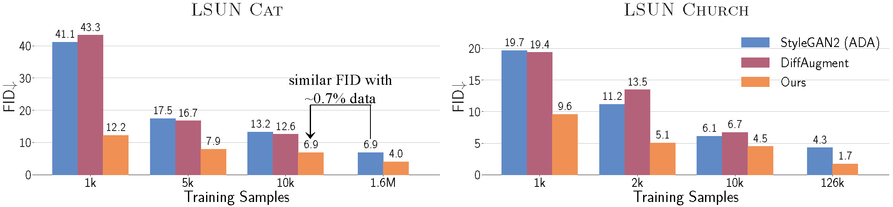
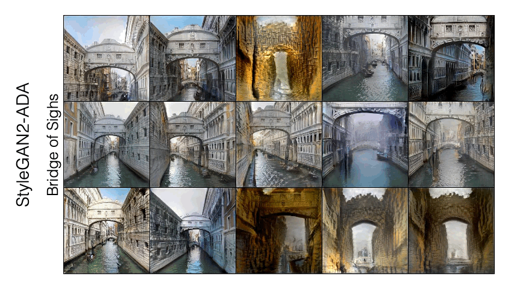
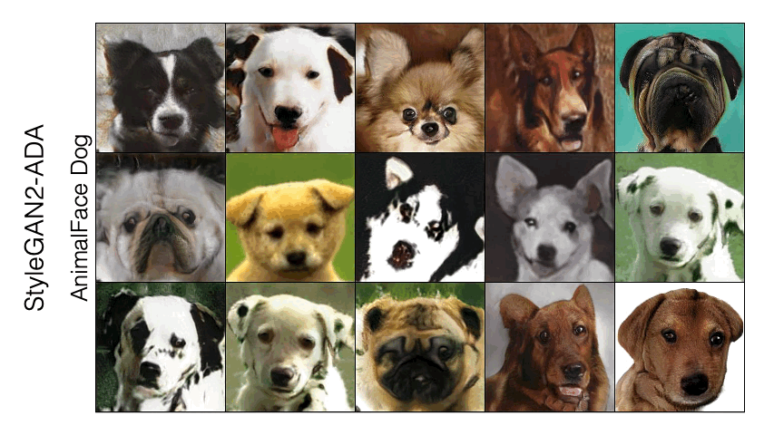
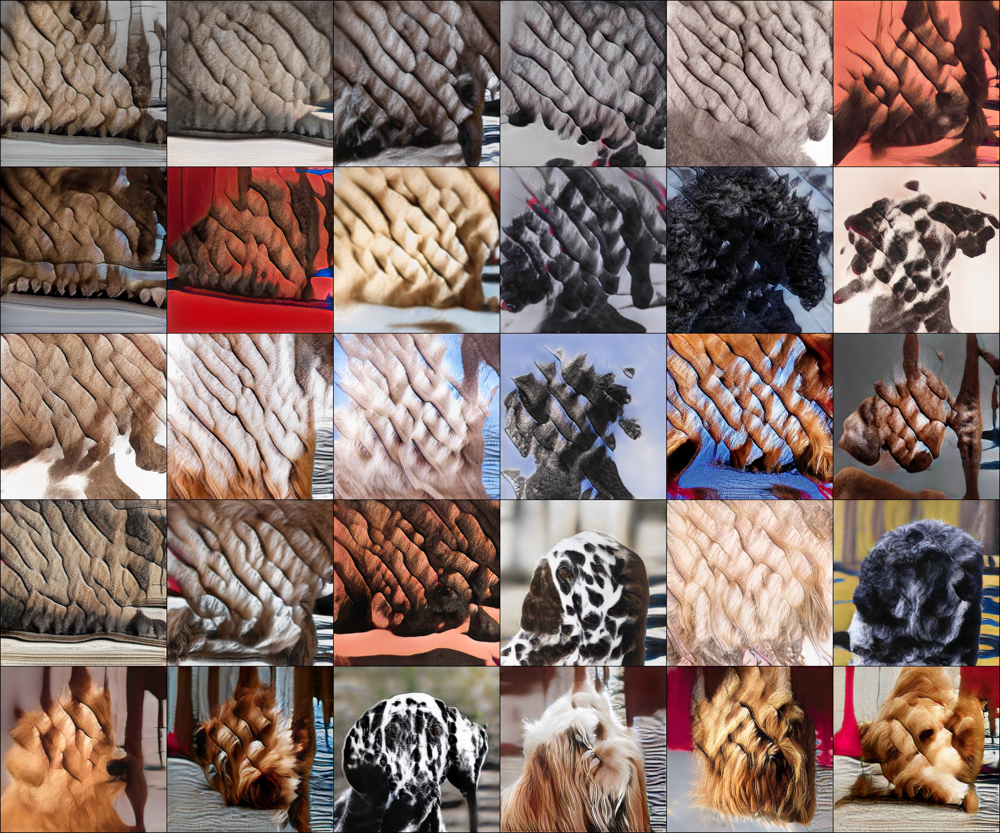
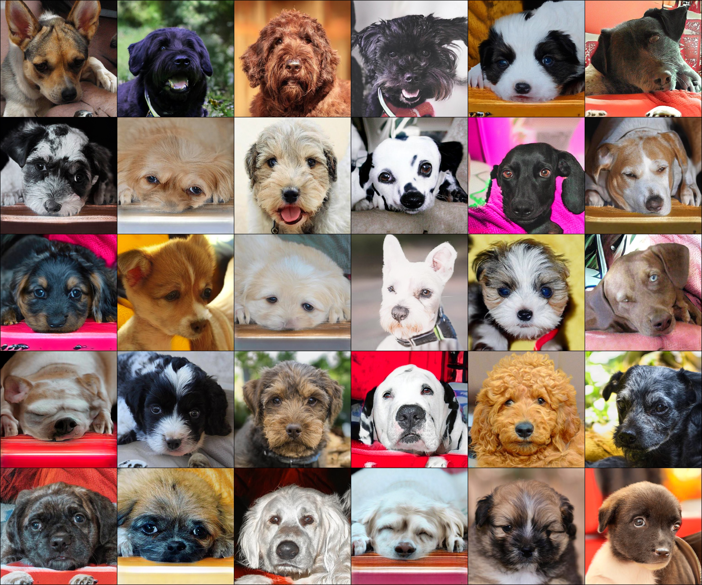
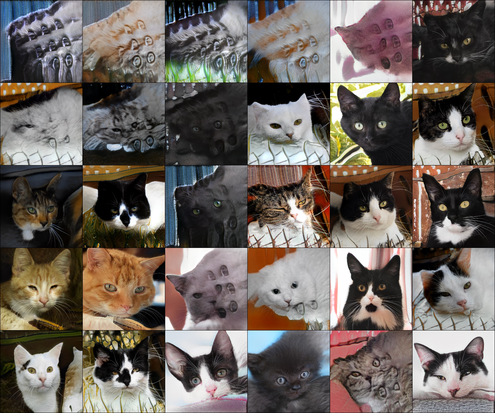
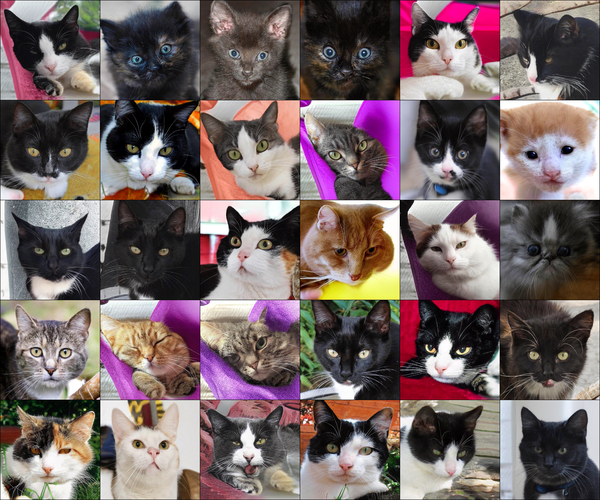
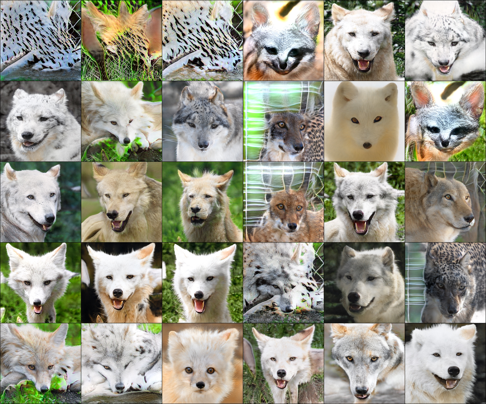
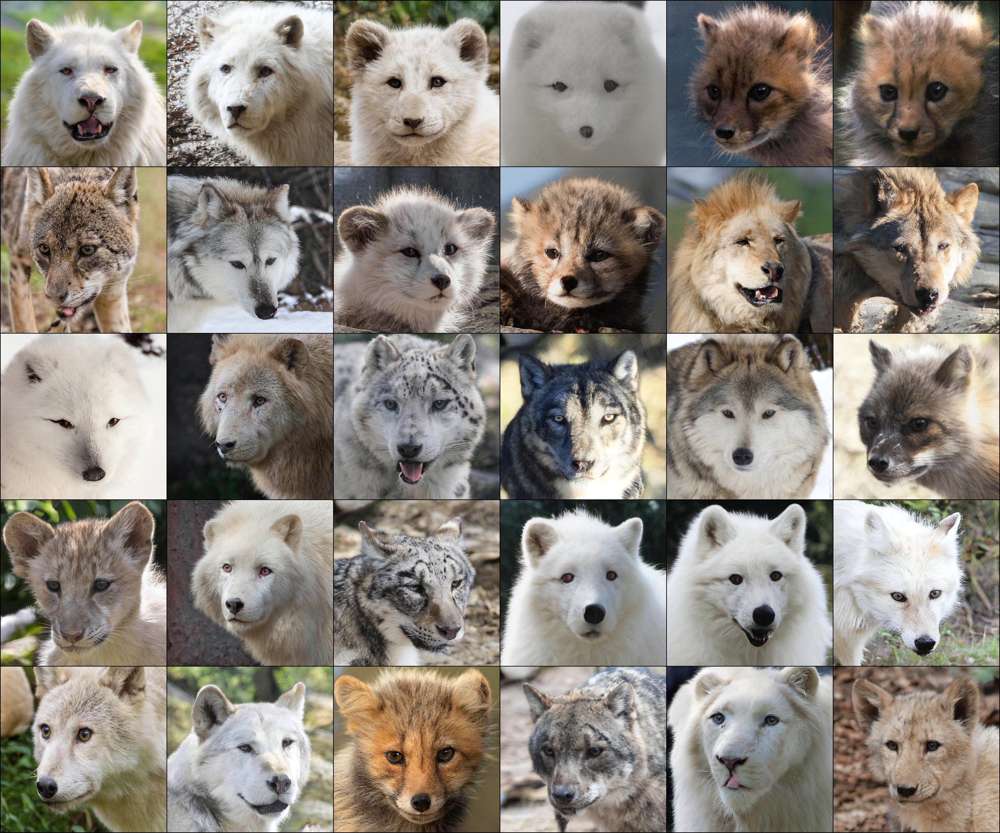

# Vision-aided GAN


[](https://paperswithcode.com/sota/image-generation-on-lsun-churches-256-x-256?p=ensembling-off-the-shelf-models-for-gan)
[](https://paperswithcode.com/sota/image-generation-on-lsun-horse-256-x-256?p=ensembling-off-the-shelf-models-for-gan)
[](https://paperswithcode.com/sota/image-generation-on-lsun-cat-256-x-256?p=ensembling-off-the-shelf-models-for-gan)


### [video](https://youtu.be/oHdyJNdQ9E4) | [website](https://www.cs.cmu.edu/~vision-aided-gan/) |   [paper](https://arxiv.org/abs/2112.09130)


**[NEW!]** Vision-aided GAN training with BigGAN and StyleGAN3

**[NEW!]** Using vision-aided Discriminator in your own GAN training.


<br>

<div class="gif">
<p align="center">

</p>
</div>

Can the collective *knowledge* from a large bank of pretrained vision models be leveraged to improve GAN training? If so, with so many models to choose from, which one(s) should be selected, and in what manner are they most effective?

We find that pretrained computer vision models can significantly improve performance when used in an ensemble of discriminators.  We propose an effective selection mechanism, by probing the linear separability between real and fake samples in pretrained model embeddings, choosing the most accurate model, and progressively adding it to the discriminator ensemble. Our method can improve GAN training in both limited data and large-scale settings.


Ensembling Off-the-shelf Models for GAN Training <br>
[Nupur Kumari](https://nupurkmr9.github.io/), [Richard Zhang](https://richzhang.github.io/), [Eli Shechtman](https://research.adobe.com/person/eli-shechtman/), [Jun-Yan Zhu](https://www.cs.cmu.edu/~junyanz/)<br>
In CVPR 2022


## Quantitative Comparison

<p align="center">
<br>
</p>

Our method outperforms recent GAN training methods by a large margin, especially in limited sample setting. For LSUN Cat, we achieve similar FID as StyleGAN2 trained on the full dataset using only 0.7\% of the dataset.  On the full dataset, our method improves FID by 1.5x to 2x on cat, church, and horse categories of LSUN.

## Example Results
Below, we show visual comparisons between the baseline StyleGAN2-ADA and our model (Vision-aided GAN) for the
same randomly sample latent code on 100-shot [Bridge-of-sighs](https://data-efficient-gans.mit.edu/datasets/100-shot-bridge_of_sighs.zip) and [AnimalFace Dog](https://data-efficient-gans.mit.edu/datasets/AnimalFace-dog.zip) dataset.




## Interpolation Videos
Latent interpolation results of models trained with our method on AnimalFace Cat (160 images), Dog (389 images),  and  Bridge-of-Sighs (100 photos).

<p align="center">

</p>


## Worst sample visualzation
We randomly sample 5k images and sort them according to Mahalanobis distance using mean and variance of real samples calculated in inception feature space. Below visualization shows the bottom 30 images according to the distance for StyleGAN2-ADA (left) and our model (right).

<details open><summary>AFHQ Dog</summary>
<p>
<div class="images">
 <table width=500>
  <tr>
    <td valign="top"></td>
    <td valign="top"></td>
  </tr>
</table>
</div>
</p>
</details>

<details><summary>AFHQ Cat</summary>
<p>
<div class="images">
 <table>
  <tr>
    <td valign="top"></td>
    <td valign="top"></td>
  </tr>
</table>
</div>
</p>
</details>

<details><summary>AFHQ Wild</summary>
<p>
<div class="images">
 <table>
  <tr>
    <td valign="top"></td>
    <td valign="top"></td>
  </tr>
</table>
</div>
</p>
</details>


### Vision-aided StyleGAN2 training
Please see [stylegan2](https://github.com/nupurkmr9/vision-aided-gan/tree/main/stylegan2) README for training StyleGAN2 models with our method. This code will reproduce all StyleGAN2 based results from our paper. 

### Vision-aided Discriminator in a custom GAN model

install the library via `pip install git+https://github.com/nupurkmr9/vision-aided-gan.git` or
```.bash
git clone https://github.com/nupurkmr9/vision-aided-gan.git
cd vision-aided-gan
pip install .
```
For details on off-the-shelf models please see [MODELS.md](docs/MODELS.md)


```python

import vision_aided_loss

device='cuda'
discr = vision_aided_loss.Discriminator(cv_type='clip', loss_type='multilevel_sigmoid_s', device=device).to(device)
discr.cv_ensemble.requires_grad_(False) # Freeze feature extractor

# Sample images
real = sample_real_image()
fake = G.forward(z)

# Update discriminator discr
lossD = discr(real, for_real=True) + discr(fake, for_real=False)
lossD.backward()

# Update generator G
lossG = discr(fake, for_G=True)
lossG.backward()

# We recommend adding vision-aided adversarial loss after training GAN with standard loss till few warmup_iter.
```

Arg details: 

* `cv_type`: name of the off-the-shelf model from `[clip, dino, swin, vgg, det_coco, seg_ade, face_seg, face_normals]`. Multiple models can be used with '+' separated model names. 
* `output_type`: output feature type from off-the-shelf models. should be one of `[conv, conv_multi_level]`. Supports `conv_multi_level` only for clip and dino. For multiple models output_type should be '+' separated output_type for each model. 
* `diffaug`: if True performs DiffAugment on vision-aided discriminator with poilcy `color,translation,cutout`. Recommended to keep this as True.
* `num_classes`: for conditional training use num_classes>0. Projection discriminator is used similar to [BigGAN](https://github.com/ajbrock/BigGAN-PyTorch). 
* `loss_type`: should be one of `[sigmoid, multilevel_sigmoid, sigmoid_s, multilevl_sigmoid_s, hinge, multilevel_hinge]`. Appeding `_s` enables [label smoothing](https://arxiv.org/abs/1606.03498). If loss_type is None output is a list of logits corresponding to each vision-aided discriminator. 
* `device`: device for off-the-shelf model weights.

### Vision-aided StyleGAN3 training
Please see [stylegan3](https://github.com/nupurkmr9/vision-aided-gan/tree/main/stylegan3) README for training StyleGAN3 models with our method.

### Vision-aided BigGAN training
Please see [biggan](https://github.com/nupurkmr9/vision-aided-gan/tree/main/biggan) README for training BigGAN models with our method.

### To add you own pretrained Model

create the class file to extract pretrained features as `vision_module/<custom_model>.py`. Add the class path in the `class_name_dict` in `vision_module.cvmodel.CVBackbone` class. Update the architecture of trainable classifier head over pretrained features in `vision_module.cv_discriminator`. Reinstall library via `pip install .`


## References

```
@InProceedings{kumari2021ensembling,
  title={Ensembling Off-the-shelf Models for GAN Training},
  author={Kumari, Nupur and Zhang, Richard and Shechtman, Eli and Zhu, Jun-Yan},
  booktitle = {Proceedings of the IEEE/CVF Conference on Computer Vision and Pattern Recognition (CVPR)},
  month     = {June},
  year      = {2022}
}
```

## Acknowledgments
We thank Muyang Li, Sheng-Yu Wang, Chonghyuk (Andrew) Song for proofreading the draft. We are also grateful to Alexei A. Efros, Sheng-Yu Wang, Taesung Park, and William Peebles for helpful comments and discussion. Our codebase is built on [stylegan2-ada-pytorch](https://github.com/NVlabs/stylegan2-ada-pytorch) and [ DiffAugment](https://github.com/mit-han-lab/data-efficient-gans).
